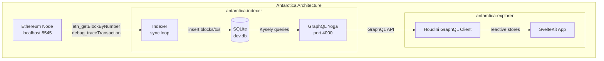
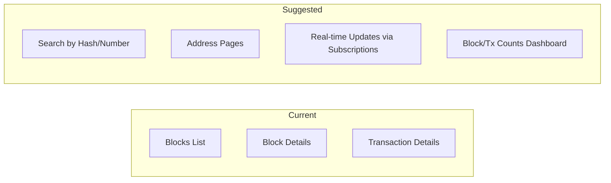

# Code Review: Antarctica - Local Blockchain Explorer

**Date:** 2026-01-24  
**Reviewer:** Kilo Code

---

## Overview

Antarctica is a monorepo containing a local blockchain explorer consisting of two packages:
- **antarctica-indexer**: Backend service that indexes blockchain data from an Ethereum JSON-RPC node
- **antarctica-explorer**: SvelteKit frontend that displays indexed blockchain data



---

## Strengths

### 1. Clean Architecture Separation
- Backend and frontend are properly separated in a pnpm workspace monorepo
- GraphQL provides a clean contract between services
- Pothos schema builder generates type-safe GraphQL schema

### 2. Modern Tech Stack
- **Backend**: Koa + GraphQL Yoga + Kysely + better-sqlite3
- **Frontend**: SvelteKit + Houdini for reactive GraphQL
- **Dev Experience**: Zellij terminal multiplexer for coordinated startup

### 3. Type Safety
- TypeScript throughout both packages
- Kysely provides type-safe SQL queries
- Houdini generates TypeScript types from GraphQL schema

### 4. Pragmatic Database Choice
- SQLite is appropriate for a local blockchain explorer
- Kysely migrations for schema versioning

---

## Issues & Recommendations

### Critical Issues

#### 1. Missing Error Handling in Frontend
**Location:** [`antarctica-explorer/src/routes/tx/[hash]/+page.svelte:9`](antarctica-explorer/src/routes/tx/[hash]/+page.svelte:9)

**Issue:**
```svelte
Hash: {$GetTransaction.data?.transaction.hash}
```
No handling for when the transaction is not found. This will silently show empty values.

**Recommendation:** Add error state handling:
```svelte
{#if $GetTransaction.errors}
    <p class="error">Transaction not found</p>
{:else if $GetTransaction.data?.transaction}
    <!-- display transaction -->
{:else if !$GetTransaction.fetching}
    <p class="loading">Loading...</p>
{/if}
```

#### 2. Unused Traced Transaction Data
**Location:** [`antarctica-indexer/src/indexer/index.ts:44-57`](antarctica-indexer/src/indexer/index.ts:44)

**Issue:**
```typescript
const tracedTransactions: EIP1193TracedTransaction[] = [];
for (const transaction of block.transactions) {
    // ... traces are collected but never used
}
```
The trace data is fetched but discarded, wasting RPC calls and potentially slowing down sync.

**Recommendation:** Either store the trace data or remove the `debug_traceTransaction` calls until needed:
```typescript
// Option 1: Store traces (requires DB migration)
await trx.insertInto('traces').values(
    tracedTransactions.map(trace => ({ tx_hash: transaction.hash, ...trace }))
).execute();

// Option 2: Remove if not needed
// Remove the entire tracing loop
```

#### 3. Hardcoded Database Path
**Location:** [`antarctica-indexer/src/db/index.ts:30`](antarctica-indexer/src/db/index.ts:30)

**Issue:**
```typescript
database: new SQLite('dev.db'),
```
The database path is hardcoded, making it inflexible for different environments.

**Recommendation:** Use environment variable:
```typescript
database: new SQLite(process.env.DATABASE_PATH || 'dev.db'),
```

---

### Medium Issues

#### 4. Confusing GraphQL Type Names
**Location:** [`antarctica-indexer/src/graphql/typeDefs.ts`](antarctica-indexer/src/graphql/typeDefs.ts:3)

**Issue:**
```typescript
export const BlockObjectType = builder.simpleObject('CreateBlockResponse', {...});
```
Types are named `CreateBlockResponse` but they're used for queries, not mutations. This is misleading.

**Recommendation:** Rename to `Block`, `Transaction`, `Address` for clarity:
```typescript
export const BlockObjectType = builder.simpleObject('Block', {
    fields: (t) => ({
        hash: t.string(),
        number: t.int(),
    }),
});
```

#### 5. No Pagination on Transactions Query
**Location:** [`antarctica-indexer/src/graphql/resolvers/transactions.ts:5-12`](antarctica-indexer/src/graphql/resolvers/transactions.ts:5)

**Issue:**
```typescript
builder.queryField('transactions', (t) =>
    t.field({
        type: [TransactionObjectType],
        resolve: async (root, args, ctx) => {
            return await ctx.db.selectFrom('transactions').selectAll().execute();
        },
    })
);
```
This returns ALL transactions without pagination, which will cause performance issues as the database grows.

**Recommendation:** Add `limit`, `offset`, and `direction` args like the [`blocks`](antarctica-indexer/src/graphql/resolvers/blocks.ts:9) query:
```typescript
builder.queryField('transactions', (t) =>
    t.field({
        type: [TransactionObjectType],
        args: {
            limit: t.arg.int({required: true}),
            offset: t.arg.int(),
            direction: t.arg({ type: Direction, defaultValue: 'desc' }),
        },
        resolve: async (root, args, ctx) => {
            return await ctx.db
                .selectFrom('transactions')
                .selectAll()
                .limit(args.limit)
                .offset(args.offset || 0)
                .orderBy('block_hash', args.direction || 'desc')
                .execute();
        },
    })
);
```

#### 6. Sync Loop Uses setTimeout Without Error Recovery
**Location:** [`antarctica-indexer/src/main.ts:40-43`](antarctica-indexer/src/main.ts:40)

**Issue:**
```typescript
async function onTimer() {
    await sync();
    setTimeout(onTimer, 1000);
}
```
If sync throws an unhandled exception, the timer stops forever.

**Recommendation:** Wrap in try/catch or use a proper scheduler:
```typescript
async function onTimer() {
    try {
        await sync();
    } catch (error) {
        console.error('Sync failed:', error);
    }
    setTimeout(onTimer, 1000);
}
```

#### 7. No Index on Foreign Key
**Location:** [`antarctica-indexer/src/db/migrations/20230602_1405.ts:7`](antarctica-indexer/src/db/migrations/20230602_1405.ts:7)

**Issue:**
```typescript
.addColumn('block_hash', 'text')
```
The `block_hash` column lacks an index, making joins with blocks table slow as the database grows.

**Recommendation:** Add index in a new migration:
```typescript
export async function up(db: Kysely<any>): Promise<void> {
    await db.schema
        .createIndex('idx_transactions_block_hash')
        .on('transactions')
        .column('block_hash')
        .execute();
    
    console.log('transactions block_hash index created!');
}
```

---

### Minor Issues

#### 8. Typo in Migration Logs
**Location:** [`antarctica-indexer/src/db/migrations/20230602_0956.ts:15`](antarctica-indexer/src/db/migrations/20230602_0956.ts:15)

```typescript
console.log(`blocks table droped!`);  // "droped" → "dropped"
```

#### 9. Inconsistent Package Naming
- Root [`package.json`](package.json:2): `"name": "antarctica"`
- Indexer [`antarctica-indexer/package.json`](antarctica-indexer/package.json:2): `"name": "antarctica-db"` (should be `antarctica-indexer`)
- Explorer [`antarctica-explorer/package.json`](antarctica-explorer/package.json:2): `"name": "antarctica"` (duplicates root)

#### 10. Unused Addresses Table
The `addresses` table is created and has GraphQL resolvers, but the indexer never populates it. Either implement address indexing or remove dead code.

**Related files:**
- [`antarctica-indexer/src/db/migrations/20230602_1607.ts`](antarctica-indexer/src/db/migrations/20230602_1607.ts:1)
- [`antarctica-indexer/src/graphql/resolvers/addresses.ts`](antarctica-indexer/src/graphql/resolvers/addresses.ts:1)

#### 11. Explorer README is Generic
[`antarctica-explorer/README.md`](antarctica-explorer/README.md:1) is the default create-svelte README and should be customized for this project.

#### 12. Hardcoded RPC Endpoint
**Location:** [`antarctica-indexer/src/main.ts:32`](antarctica-indexer/src/main.ts:32)

```typescript
export const provider = new JSONRPCHTTPProvider('http://127.0.0.1:8545');
```

Should use environment variable:
```typescript
export const provider = new JSONRPCHTTPProvider(
    process.env.RPC_URL || 'http://127.0.0.1:8545'
);
```

#### 13. Next Block Link Always Shows
**Location:** [`antarctica-explorer/src/routes/block/[hash]/+page.svelte:37`](antarctica-explorer/src/routes/block/[hash]/+page.svelte:37)

```svelte
<p>
    <a href={`/block/${next}`}>next</a>
</p>
```
The "next" link always shows even when the next block doesn't exist yet. Should check if block exists first.

---

## Security Considerations

1. **No CORS Configuration** - The GraphQL API has no CORS restrictions, acceptable for local use but should be configured for production
2. **No Rate Limiting** - API could be overwhelmed with requests
3. **No Input Validation** - GraphQL args are not validated beyond type checking
4. **SQLite in Production** - SQLite is fine for local development but consider PostgreSQL for production scalability

---

## Suggested Improvements

### Feature Enhancements



1. **Add Search Functionality** - Allow searching by block number, block hash, or transaction hash
2. **Implement Address Pages** - Show transactions involving an address
3. **Add GraphQL Subscriptions** - Real-time updates when new blocks arrive
4. **Dashboard Stats** - Show total blocks, transactions, latest activity

### Code Quality Improvements

1. Add ESLint to both packages
2. Add unit tests for resolvers
3. Add integration tests for the sync flow
4. Add proper logging library (currently uses console.log)
5. Add health check endpoint for the GraphQL server

### Performance Improvements

1. Batch RPC requests where possible
2. Add connection pooling if moving to PostgreSQL
3. Cache frequently accessed data (latest block number)
4. Implement proper backoff for failed RPC requests

---

## File Summary

| File | Issues |
|------|--------|
| [`antarctica-indexer/src/main.ts`](antarctica-indexer/src/main.ts:1) | Error handling, hardcoded RPC URL |
| [`antarctica-indexer/src/indexer/index.ts`](antarctica-indexer/src/indexer/index.ts:1) | Unused trace data |
| [`antarctica-indexer/src/db/index.ts`](antarctica-indexer/src/db/index.ts:1) | Hardcoded DB path |
| [`antarctica-indexer/src/graphql/typeDefs.ts`](antarctica-indexer/src/graphql/typeDefs.ts:1) | Misleading type names |
| [`antarctica-indexer/src/graphql/resolvers/transactions.ts`](antarctica-indexer/src/graphql/resolvers/transactions.ts:1) | No pagination |
| [`antarctica-indexer/src/db/migrations/20230602_0956.ts`](antarctica-indexer/src/db/migrations/20230602_0956.ts:1) | Typo in log |
| [`antarctica-explorer/src/routes/tx/[hash]/+page.svelte`](antarctica-explorer/src/routes/tx/[hash]/+page.svelte:1) | No error handling |
| [`antarctica-explorer/src/routes/block/[hash]/+page.svelte`](antarctica-explorer/src/routes/block/[hash]/+page.svelte:1) | Next link always shows |
| [`antarctica-explorer/README.md`](antarctica-explorer/README.md:1) | Generic content |

---

## Summary

| Category | Status | Notes |
|----------|--------|-------|
| Architecture | ✅ Good | Clean separation of concerns |
| Type Safety | ✅ Good | TypeScript + generated types |
| Error Handling | ⚠️ Needs work | Frontend lacks error states, backend sync can crash |
| Performance | ⚠️ Needs work | Missing indexes and pagination |
| Code Quality | ⚠️ Fair | Dead code, inconsistencies, typos |
| Documentation | ❌ Minimal | Generic READMEs, no API docs |
| Security | ⚠️ Local only | No CORS, rate limiting, or input validation |

### Overall Assessment

The project is a solid proof-of-concept demonstrating modern web development practices with a good tech stack choice. However, it requires the following before production use:

1. **Must Fix**: Error handling in frontend and backend sync loop
2. **Should Fix**: Pagination on transactions, database indexes, cleanup dead code
3. **Nice to Have**: Better naming, documentation, feature enhancements

---

## Action Items

- [ ] Add error handling to all frontend pages
- [ ] Store or remove traced transaction data
- [ ] Make DB and RPC URLs configurable via env vars
- [ ] Rename GraphQL types for clarity
- [ ] Add pagination to transactions query
- [ ] Add error recovery to sync loop
- [ ] Create migration for `transactions.block_hash` index
- [ ] Fix typo in migration logs
- [ ] Fix package naming consistency
- [ ] Implement or remove addresses table functionality
- [ ] Customize explorer README
- [ ] Add ESLint configuration
- [ ] Add unit tests